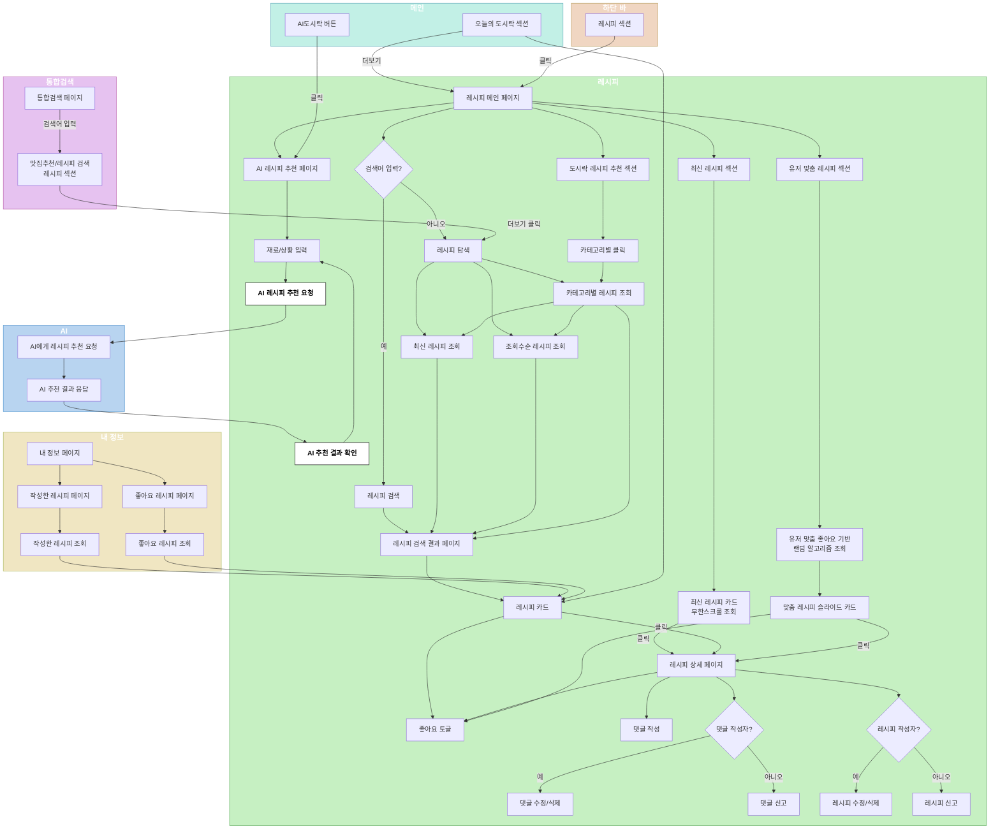
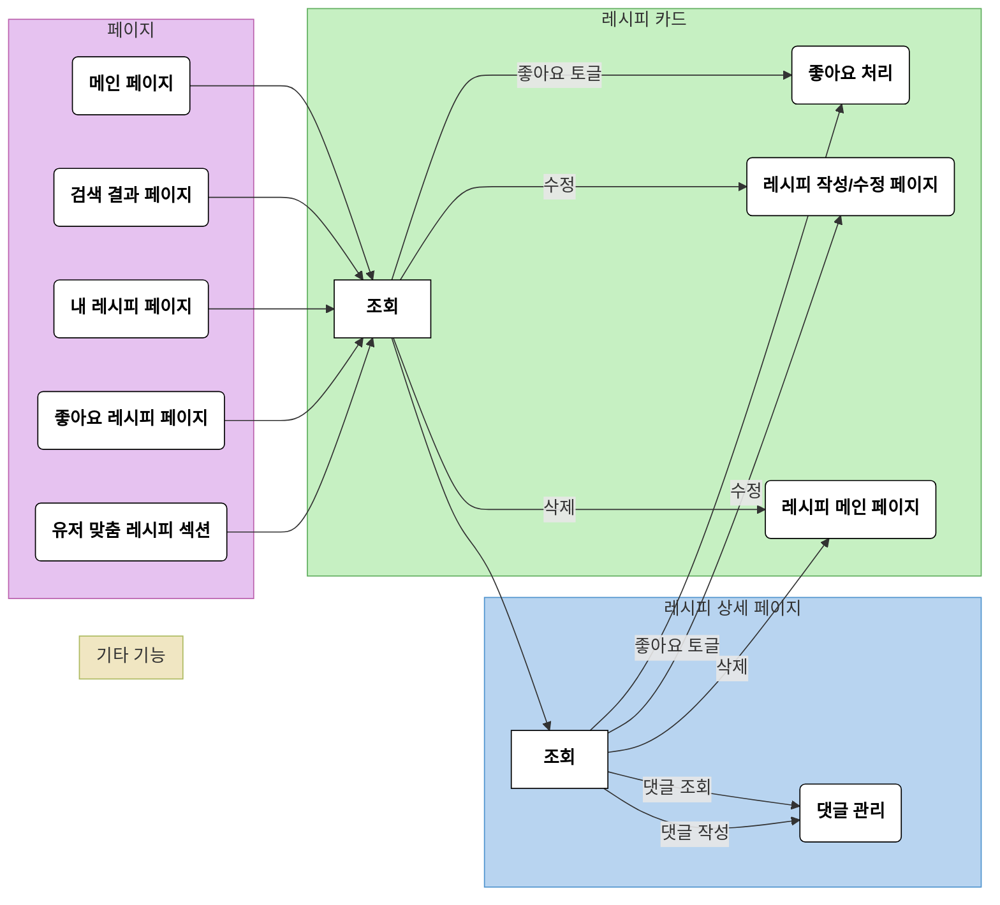
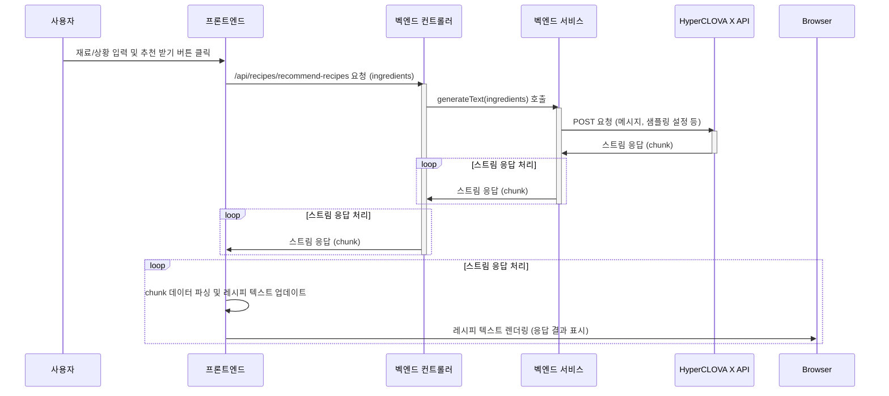
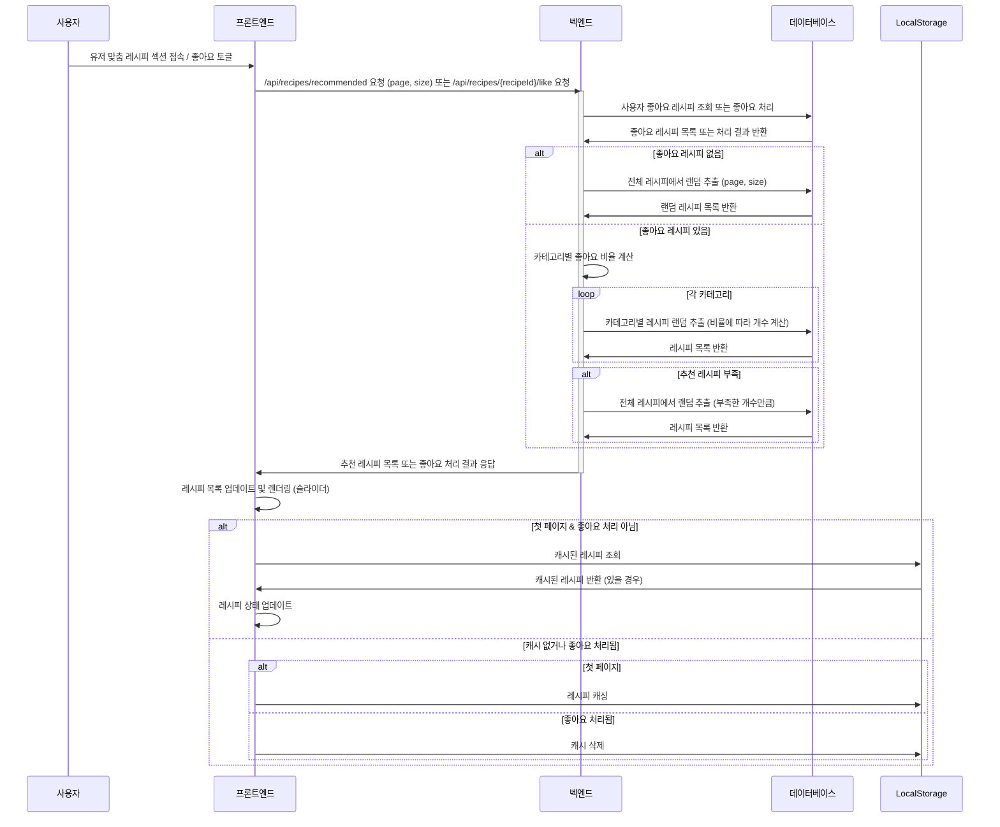
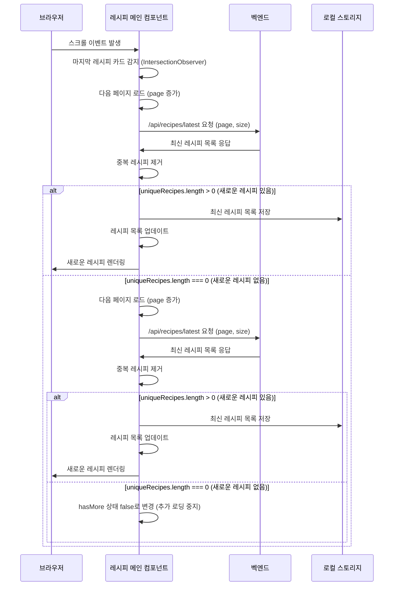

# 밥플(Bobple)의 레시피 플랫폼 서비스 [본인기여 부분]

<div align="center">


</div>

## 팀 정보

* **개발**: 밥플 개발팀 (밥먹조)

**AI와 함께하는 맛있는 레시피 탐험**

밥플은 AI 기술을 활용하여 사용자에게 개인 맞춤형 레시피를 추천하고, 다양한 검색 및 필터링 기능을 통해 원하는 레시피를 쉽고 빠르게 찾을 수 있도록 돕는 레시피 플랫폼 서비스입니다. 또한, 사용자들은 밥플에서 자신만의 레시피를 공유하고, 댓글 기능을 통해 다른 사용자들과 활발하게 소통하며 요리에 대한 즐거움을 함께 나눌 수 있습니다. 

## 핵심 기능

* **레시피 검색 & 필터링**: 키워드, 카테고리, 정렬 기준으로 원하는 레시피를 빠르게 찾아보세요. 🔍
* **AI 레시피 추천**: 냉장고 파먹기, 특별한 날, 혹은 그저 떠오르는 생각만으로도 딱 맞는 레시피를 AI가 추천해드립니다. 🤖
* **유저 맞춤 레시피 추천**: 당신의 취향을 저격하는 맞춤 레시피를 만나보세요. ❤️
* **최신 레시피**: 끊임없이 업데이트되는 새로운 레시피들을 무한 스크롤로 즐겨보세요. ⏰
* **나만의 레시피 공유**: 자신만의 특별한 레시피를 등록하고, 다른 사용자들과 댓글로 소통하며 요리의 즐거움을 나누세요. 💬
* **편리한 사용성**: 반응형 디자인으로 PC, 태블릿, 모바일 어디서든 편리하게 밥플을 이용할 수 있습니다. 📱

## 프로젝트소개 PPT

[https://www.canva.com/design/DAGOd9x9olI/TdxsjBoguAzGUuwSUy7Igg/view?utm_content=DAGOd9x9olI&utm_campaign=designshare&utm_medium=link&utm_source=editor
](https://www.canva.com/design/DAGO39M5cug/GZswv0GTmSk_QwyPXvInRg/view?utm_content=DAGO39M5cug&utm_campaign=designshare&utm_medium=link&utm_source=editor)

## 기술 스택

* **프론트 엔드💻**
 
</br>

    
* **벡 엔드🎛️**

</br>

    
* **외부 서비스 🌐**

</br>
  
 

## 프로젝트 구조

```
밥플
├── frontend
│   ├── components
│   │   ├── ... (공통 컴포넌트)
│   │   └── recipe
│   │       ├── AIRecommendation.jsx
│   │       ├── LatestRecipeCard.jsx
│   │       ├── MyLikeRecipe.jsx
│   │       ├── MyRecipe.jsx
│   │       ├── RecipeCard.jsx
│   │       ├── RecipeDetail.jsx
│   │       ├── RecipeForm.jsx
│   │       ├── RecipeMain.jsx
│   │       ├── RecipeModify.jsx 
│   │       └── RecipeSearchResults.jsx
│   ├── pages
│   │   └── recipe
│   │       └── RecipeContext.jsx
│   ├── router
│   │   └── RecipeRouter.jsx
│   └── utils
│       ├── axios.js
│       └── localStorageUtils.js
└── backend
    ├── controller
    │   ├── ...
    │   ├── LikeRecipeController.java
    │   ├── RecipeCommentController.java
    │   └── RecipeController.java 등 레시피 관련 컨트롤러
    ├── dto
    │   ├── ...
    │   └── RecipeDto.java 등 레시피 관련 DTO
    ├── entity
    │   ├── ...
    │   └── Recipe.java 등 레시피 관련 엔티티
    ├── repository
    │   ├── ...
    │   └── RecipeRepository.java 등 레시피 관련 레포지토리
    └── service
        ├── ...
        ├── HyperCLOVAClient.java
        └── RecipeService.java 등 레시피 관련 서비스
```


---


## 핵심 기술 설명
* **AI기반 상황, 재료 맞춤형 레시피 추천**: 사용자가 입력한 채팅에 기반하여 Hyper Clova X API 를 활용, 주어진 상황에 맞게 음식 메뉴와 레시피를 추천합니다.
* **개인 맞춤형 레시피 추천**: 사용자의 좋아요 기록을 분석하여 선호 카테고리에 가중치를 부여하고, 각 카테고리 내에서 레시피를 랜덤 추출하여 개인화된 추천 목록을 제공합니다.
* **무한 스크롤**: Intersection Observer를 활용하여 사용자 스크롤에 따라 자동으로 다음 페이지의 레시피를 불러와 끊김 없는 탐색 경험을 제공합니다.
* **로컬 스토리지 캐싱**: 첫 페이지 데이터를 로컬 스토리지에 저장하여 빠른 로딩 속도를 제공하고 서버 부하를 줄입니다.
* **비동기 통신**: Axios와 Spring WebFlux를 활용하여 벡엔드와 프론트엔드 간의 효율적인 비동기 통신을 구현했습니다.

## 밥플 레시피 CRUD 기능

**개요**

밥플 레시피 CRUD 기능은 사용자가 레시피를 생성(Create), 읽기(Read), 수정(Update), 삭제(Delete) 할 수 있도록 지원하는 핵심 기능입니다. 사용자는 레시피를 등록하고, 다른 사용자들이 등록한 레시피를 검색하고 조회하며, 자신이 등록한 레시피를 수정하거나 삭제할 수 있습니다.

**기능 상세**

### 1. 레시피 생성 (Create)

* **핵심 컴포넌트**: `RecipeForm.jsx`
* **주요 기능**:
    * 레시피 제목, 내용(재료 및 조리 방법), 카테고리, 태그, 이미지 등 입력
    * 이미지 업로드 및 미리보기 기능 제공
    * 텍스트 입력 영역 자동 높이 조절
    * 입력 데이터 유효성 검사
    * 벡엔드 API 호출하여 레시피 정보 저장
    * 레시피 등록 성공 시 포인트 지급 및 레시피 상세 페이지로 이동

* **백엔드 API**:
    * `POST /api/recipes`: 레시피 정보 및 이미지 파일을 벡엔드에 전송하여 새로운 레시피 생성
    * `POST /api/point/result/update`: 레시피 등록 성공 시 사용자에게 포인트 지급

### 2. 레시피 조회 (Read)

* **핵심 컴포넌트**: `RecipeMain.jsx`, `RecipeSearchResults.jsx`, `RecipeDetail.jsx`, `RecipeCard.jsx`, `LatestRecipeCard.jsx`
* **주요 기능**:
    * 다양한 레시피 목록 조회:
        * 최신 레시피 (무한 스크롤)
        * 유저 맞춤 레시피 (슬라이더)
        * 카테고리별 레시피
        * 검색 결과 레시피
    * 레시피 상세 정보 조회:
        * 레시피 제목, 내용, 이미지, 작성자 정보, 작성일, 조회수, 좋아요 수, 댓글 등 상세 정보 제공
        * 조회수 자동 증가
    * 레시피 카드:
        * 레시피 목록에서 각 레시피의 핵심 정보(이미지, 제목, 작성자, 조회수 등)를 간략하게 표시
        * 좋아요, 댓글 수 표시
        * 작성자에게 수정/삭제 버튼 제공

* **백엔드 API**:
    * `GET /api/recipes/latest`: 최신 레시피 목록 조회 (페이지네이션)
    * `GET /api/recipes/recommended`: 유저 맞춤 레시피 목록 조회 (페이지네이션)
    * `GET /api/recipes/search`: 키워드, 카테고리, 정렬 기준에 따른 레시피 검색 (페이지네이션)
    * `GET /api/recipes/{recipeId}`: 레시피 상세 정보 조회
    * `POST /api/recipes/{recipeId}/increment-views`: 레시피 조회수 증가

### 3. 레시피 수정 (Update)

* **핵심 컴포넌트**: `RecipeForm.jsx` (레시피 생성 컴포넌트 재사용)
* **주요 기능**:
    * 레시피 ID를 URL 파라미터로 받아 수정 모드 활성화
    * 기존 레시피 정보 조회 및 폼에 자동 입력
    * 레시피 제목, 내용, 카테고리, 태그, 이미지 등 수정 가능
    * 이미지 변경 시 새로운 이미지 업로드 및 미리보기 제공
    * 입력 데이터 유효성 검사
    * 벡엔드 API 호출하여 레시피 정보 업데이트
    * 레시피 수정 성공 시 수정된 레시피 상세 페이지로 이동

* **백엔드 API**:
    * `GET /api/recipes/{recipeId}`: 레시피 상세 정보 조회 (수정 페이지 초기 데이터 로드)
    * `PUT /api/recipes/{recipeId}`: 레시피 정보 및 이미지 파일(선택 사항)을 벡엔드에 전송하여 레시피 수정

### 4. 레시피 삭제 (Delete)

* **핵심 컴포넌트**: `RecipeCard.jsx`, `RecipeDetail.jsx`
* **주요 기능**:
    * 레시피 작성자에게만 삭제 버튼 표시
    * 삭제 버튼 클릭 시 사용자에게 확인 절차 진행
    * 삭제 확인 시 벡엔드 API 호출하여 레시피 삭제
    * 레시피 삭제 성공 시 포인트 차감 및 레시피 목록 페이지로 이동
    * 로컬 스토리지에서 관련 레시피 데이터 삭제

* **백엔드 API**:
    * `DELETE /api/recipes/{recipeId}`: 레시피 삭제
    * `POST /api/point/result/update`: 레시피 삭제 성공 시 사용자 포인트 차감



---

## AI 레시피 추천 기능

**개요**

밥플의 AI 레시피 추천 기능은 사용자가 입력한 재료나 상황에 따라 HyperCLOVA X AI 모델을 활용하여 최적의 레시피를 추천합니다. 냉장고에 남은 재료를 활용하거나 특별한 날을 위한 요리를 찾을 때 유용하며, 레시피를 생성하여 사용자에게 피드백을 제공합니다.

**핵심 기술**

* **HyperCLOVA X**: 한국어에 특화된 네이버의 생성형 AI 모델로, 한국 문화와 맥락을 깊이 이해하고 자연스러운 한국어 문장을 생성할 수 있습니다. 밥플에서는 HyperCLOVA X를 활용하여 사용자의 입력에 맞는 레시피를 생성하고 추천합니다.
* **HyperCLOVA X DASH**: HyperCLOVA X를 더욱 빠르고 저렴하게 사용할 수 있는 모델입니다. 밥플에서는 HCX DASH 001 모델을 활용하여 더욱 빠르고 효율적인 AI 레시피 추천 서비스를 제공합니다.
* **Spring WebFlux**: 벡엔드에서 비동기 스트림 처리를 가능하게 하는 기술입니다. HyperCLOVA X API의 스트림 응답을 효율적으로 처리하고, 프론트엔드에 실시간으로 데이터를 전달합니다.

**동작 방식**



1. **사용자 입력**: 사용자가 AI 레시피 추천 페이지에서 재료 또는 상황을 입력하고 "추천 받기" 버튼을 클릭합니다.
2. **프론트엔드 요청**: 프론트엔드는 입력된 정보를 벡엔드 API `/api/recipes/recommend-recipes`에 요청합니다.
3. **벡엔드 처리**: 벡엔드 컨트롤러는 `HyperCLOVAClient`의 `generateText` 메서드를 호출하여 HyperCLOVA X API에 레시피 생성을 요청합니다.
4. **HyperCLOVA X API**: HyperCLOVA X는 입력된 정보를 기반으로 레시피를 생성하고, 생성된 레시피를 스트림 형태로 벡엔드에 반환합니다.
5. **벡엔드 스트림 처리**: 벡엔드는 HyperCLOVA X로부터 받은 스트림 응답을 프론트엔드에 전달합니다.
6. **프론트엔드 스트림 처리**: 프론트엔드는 벡엔드로부터 받은 스트림 응답을 실시간으로 처리하고, 화면에 레시피 추천 결과를 업데이트하여 사용자에게 보여줍니다.

**장점**

* **개인 맞춤형 추천**: 사용자의 입력과 맥락을 이해하여 맞춤형 레시피를 제공합니다.
* **한국어 특화 / 빠른 응답 속도**: HyperCLOVA X DASH 모델과 비동기 통신을 통해 빠른 응답 속도를 제공합니다.

## 유저 맞춤 레시피 추천

**개요**

밥플의 유저 맞춤 레시피 추천 기능은 사용자 개개인의 취향을 고려하여 레시피를 추천합니다. 사용자의 좋아요 기록을 분석하여 선호하는 카테고리의 레시피를 우선적으로 추천하며, 랜덤 요소를 가미하여 다양한 레시피들을 이용할 수 있도록 구현하였습니다.

**핵심 기술**

* **좋아요 기반 추천 알고리즘**: 사용자의 좋아요 데이터를 기반으로 카테고리별 선호도를 분석하고, 이를 바탕으로 맞춤 레시피를 추천합니다. 
* **로컬 스토리지 캐싱**: 첫 페이지의 추천 레시피를 로컬 스토리지에 저장하여 빠른 로딩 속도를 제공하고 서버 부하를 줄입니다. 
* **비동기 데이터 로딩**: 사용자 경험 향상을 위해 페이지네이션을 통해 데이터를 점진적으로 불러오고, 로딩 상태를 시각적으로 표시합니다.

**동작 방식**


---

1. **사용자 좋아요 데이터 수집**: 벡엔드는 데이터베이스에서 사용자의 좋아요 기록을 가져옵니다.
2. **카테고리별 선호도 분석**: 좋아요한 레시피들의 카테고리 분포를 분석하여, 각 카테고리의 선호도 비율을 계산합니다.
3. **추천 레시피 선정**: 
    * 각 카테고리의 선호도 비율에 따라 추천할 레시피 개수를 정합니다.
    * 각 카테고리 내에서 랜덤하게 레시피를 추출합니다.
    * 필요한 경우, 전체 레시피에서 추가로 랜덤 추출하여 추천 목록을 완성합니다.
4. **프론트엔드에 데이터 제공**: 벡엔드는 추출된 레시피 목록을 페이지네이션하여 프론트엔드에 전달합니다.
5. **화면 렌더링**: 프론트엔드는 받은 레시피 목록을 슬라이더 형태로 렌더링하고, 로컬 스토리지에 캐싱합니다.
6. **좋아요 업데이트**: 사용자가 좋아요 버튼을 클릭하면 벡엔드에 좋아요 토글 요청을 보내고, 로컬 스토리지 캐시를 삭제하여 변경 사항을 즉시 반영합니다.

**장점**

* **개인화된 추천**: 사용자의 취향을 반영한 레시피를 추천하여 만족도를 높입니다.
* **다양한 레시피 탐색**: 랜덤 추출을 통해 새로운 레시피를 보여줍니다.
* **사용자 참여 유도**: 좋아요 기능을 통해 사용자의 참여를 유도하고, 추천 시스템을 개선합니다.
* **성능 최적화**: 로컬 스토리지 캐싱과 비동기 데이터 로딩을 통해 서버 부하를 줄입니다.

## 무한 스크롤 기능

**개요**

밥플의 레시피 메인 페이지는 **무한 스크롤** 기능을 통해 사용자에게 끊김 없는 레시피 탐색 경험을 제공합니다. 사용자가 스크롤을 내려 마지막 레시피 카드에 도달하면 자동으로 다음 페이지의 레시피를 불러와 화면에 추가합니다.

**핵심 기술**

* `IntersectionObserver`: 마지막 레시피 카드가 화면에 보이는지 감지하여 추가 레시피 로딩을 트리거합니다.
* `localStorage`: 첫 페이지의 레시피 데이터를 캐싱하여 초기 로딩 속도를 개선하고 서버 부하를 줄입니다.
* `페이지네이션`: 벡엔드 API에서 페이지 단위로 레시피 데이터를 제공하여 효율적인 데이터 로딩을 가능하게 합니다.

**동작 방식**



1. **초기 로드**: 컴포넌트가 처음 마운트될 때, 로컬 스토리지에서 캐시된 레시피를 확인합니다. 캐시된 레시피가 없거나 페이지가 변경된 경우에는 벡엔드 API에 첫 페이지 레시피 목록을 요청합니다.
2. **스크롤 이벤트**: 사용자가 스크롤하여 마지막 레시피 카드에 도달하면 `IntersectionObserver`가 이를 감지하고, 다음 페이지의 레시피를 불러오도록 합니다.
3. **중복 레시피 제거**: 벡엔드에서 받아온 레시피 목록에서 이미 로드된 레시피와 중복되는 레시피를 제거하여 불필요한 데이터 로딩을 방지합니다.
4. **레시피 추가 및 캐싱**: 새로운 레시피가 있으면 레시피 목록에 추가하고, 첫 페이지의 경우 로컬 스토리지에 캐싱합니다.
5. **로딩 상태 관리**: 레시피 로딩 중에는 로딩 스피너를 표시하고, 모든 레시피를 로드했거나 새로운 레시피가 없는 경우 추가 로딩을 중지합니다.

**장점**

* **사용자 경험 향상**: 끊김 없는 레시피 탐색 경험을 제공합니다.
* **성능 최적화**: 로컬 스토리지 캐싱과 중복 레시피 제거를 통해 불필요한 데이터 로딩을 방지하고, 초기 로딩 속도를 개선합니다.
* **서버 부하 감소**: 페이지네이션을 통해 필요한 데이터만 요청하여 서버 부하를 줄입니다.


**라이선스**

* 이 프로젝트는 MIT 라이선스를 따릅니다. 자세한 내용은 `LICENSE` 파일을 참고하세요.


